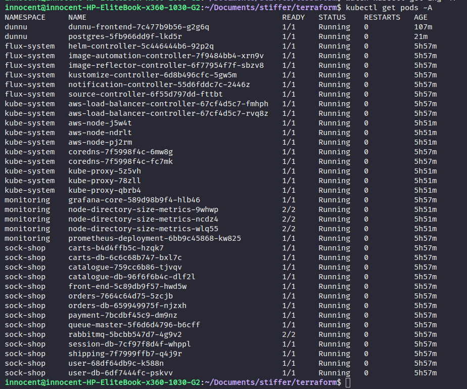

## A Full CI/CD Deployment to a kubernetes cluster using flux and helm as a GitOps approach with app image being built and pushed to Docker Hub using Github Actions, providing a Full CI/CD Pipeline
---


### Prerequisites: 
- make sure ansible is installed and your host machine should be a linux machine, idealy an ubuntu machine.
- github PAT


### Steps:

- clone this repository

- cd into the **ansible** directory and run `ansible-playbook main.yml`. This would install all the required software on your host machine.


- make sure a user profile is set on your machine using **aws cli**, this user should have the following permissions:

    - AmazonEC2FullAccess
    - AmazonEKSFullAccess
    - AmazonEKSClusterPolicy
    - AmazonEKSServicePolicy
    - AmazonEKSVPCResourceController
    - AmazonRoute53FullAccess
    - AmazonS3FullAccess
    - IAMFullAccess
    - AmazonVPCFullAccess
    - AmazonElastic

#### Optional - only if you have multiple user profile setup on your machine
run this command to make sure your user profile is set as the user for your shell environment:
```shell
$   export AWS_PROFILE=<user name>
```

- cd into  **terraform** directory. checkout the **terraform.tfvars** file and set the "profile" and "AWS_REGION" values to your "aws username" and preferred "region" respectively.

- run `terraform init` then `terraform apply -auto-approve` to setup the infrastructure.

- once this is successful, run:
```shell
$   aws eks update-kubeconfig --name <cluster name> --region <your user profile region>
```
to store your cluster config, so kubectl can use it. then run:
```bash
kubectl get nodes
```
to verify that your cluster is up and running.

- run
```bash
helm list -n kube-system
```
to see if your alb controller was installed

- run:
```bash
kubectl logs -f -n kube-system -l app.kubernetes.io/name=aws-load-balancer-controller
```
to verify that there are no issues in your controller, before deploying your first ingress.

- run:
```bash
flux check --pre
```
to make sure your cluster is okay

- then export your GITHUB_TOKEN and GITHUB_USER environment variables:
```bash
export GITHUB_TOKEN=<token>
export GITHUB_USER=<github username>
```

run flux bootstrap for the flux repo using

```bash
flux bootstrap github \
--components-extra=image-reflector-controller,image-automation-controller \
--owner=$GITHUB_USER \
--repository=\<repo name> \
--branch=master \
--path=./clusters/my-cluster \
--personal
```

clone the repo to your local machine and cd into the repo directory
cd into `clusters/my-cluster` and put all your source and kustomization manifest files from the [source](./source/) directory in this repo into the `clusters/my-cluster/  directory of this repo created by flux. 

For the different files in the `source` directory, you would need to fork the repository values of the `url` field and replace the url with your forked repo in files matching `*source*.yaml`. Save and push changes.

flux would automatically pick these changes and apply the deployments, it will also watch the repository defined in this files, for any change. At which it would update the deployments.

From files matching `*kustomization.yaml` trace the path value with respect to your forked repositories. Locate the ingress.yaml file in those repositories and change the host value to your domain name.

If you have an acm key for your domain, change the `acm.certificateArn` value in the `ingress.yaml` file to your acm key. If not comment out that line as well as the `alb.ingress.kubernetes.io/ssl-redirect: "443"` line.

create postgres db password as kubernetes secret:

`kubectl create secret generic postgres-secret --from-literal='POSTGRES_PASSWORD=<your-password>' -n <namespace>`

it has to be the same namespace as the postgres deployment.

Flux would automatically pick the changes from the repo and reconcile them based on the time you set while bootstrapping your flux controller. You could fast track this porcess by just running `flux reconcile ks flux-system --with-source`. And this would update your cluster state based on your flux repo.

Once your deployment is complete, run 
`kubectl get ingress -A` to get the load balancer url for all your ingress. Take the alb dns name as well as each subdomain for the respective ingress and create CNAME record for all sub-domains with the alb dns name in your domain registrar.

you can now visit:

socks.codekami.tech - socks shop
dunnu.codekami.tech - dunnu
prometheus.codekami.tech - prometheus monitoring
grafana.codekami.tech - grafana monitoring (login - username: admin, password: admin)


Once you're done, run `kubectl get pods -A` and you should get something like this:




<br>
<br>

The Image build and versioned updates for the  [**dunnu app**](https://github.com/Innocent9712/deploy-dunnu) is automated using github actions.
<br>

To destroy your infrastructure, you first have to manually destroy your alb from your aws console or using aws cli, along with 2 security groups that were created while bringing up the infrastructure. Then proceed to run `terraform destroy` in the **terraform** directory, and respond `yes` to the prompt. All you resources should be destroyed in a few minutes.

<br>
<br>
<br>
<br>
<br>

---

The codebase for the sock shop can be found at:
https://github.com/Innocent9712/microservices-demo

And the kustomization responsible for the GitOps CI/CD is located in the `deploy/kubernetes/` directory of the repository.

The codebase for dunnu can be found at:
https://github.com/Innocent9712/deploy-dunnu

And the kustomization responsible for the GitOps CI/CD is located in the root directory of the repository.

The codebase for the flux can be found at:
https://github.com/Innocent9712/exam-deployment-with-flux (this repo is private)

This repository was created by flux and is used by flux to manage the flux system in my cluster and make sure everything is up to date.
